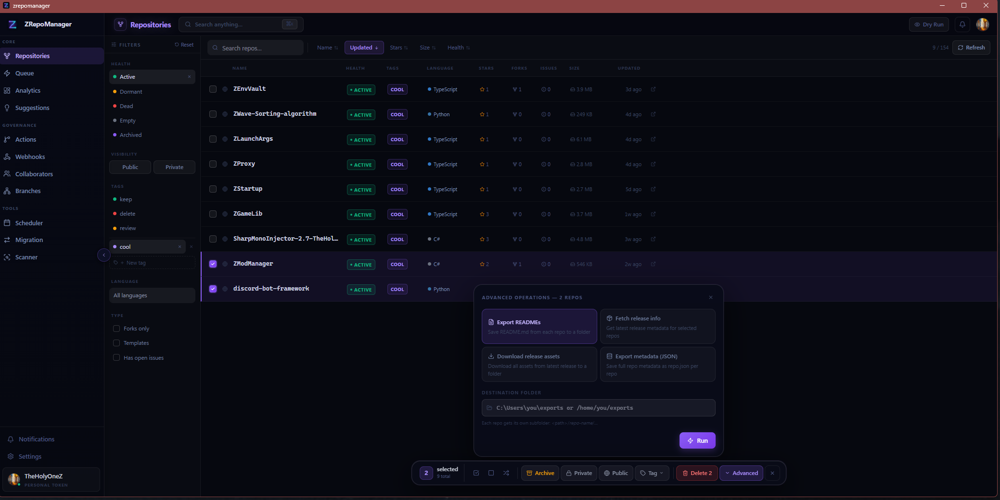

<div align="center">



<h1>ZRepoManager</h1>

<p>A blazing-fast desktop app for managing every GitHub repository you've ever touched.<br/>
Bulk operations, smart queues, analytics, file management — all from one native window.</p>

<p>
  <a href="https://zsync.eu/repomanager/">🌐 Website</a> &nbsp;·&nbsp;
  <a href="https://zsync.eu/repomanager/">⬇️ Download Builds</a> &nbsp;·&nbsp;
  <a href="https://github.com/TheHolyOneZ/RepositoryManager/">📦 Repository</a> &nbsp;·&nbsp;
  <a href="./LICENSE">GPL-3.0</a>
</p>

<p>
  
  
  
  
</p>

</div>

---

## What it does

ZRepoManager replaces 50 browser tabs and endless GitHub UI clicking. Connect your GitHub account, load all your repos, and do in seconds what normally takes minutes:

- **Select hundreds of repos** and archive, delete, rename, transfer, or change visibility in one shot
- **Queue complex batches** with dry-run preview, grace periods, pause/resume/skip/cancel mid-run
- **Browse and manage files** inside any repo — rename, move, delete, commit atomically
- **Upload local folders** straight to a repo without hitting GitHub's 100-file drag limit
- **Analyze your portfolio** — language stats, growth timeline, health decay, per-repo breakdowns
- **Get smart suggestions** — surfaces dead repos, empty repos, abandoned forks, near-duplicate names
- **Right-click anywhere** for context menus on repos, files, and upload entries

---

## Features

<details>
<summary><strong>Repositories & Bulk Operations</strong></summary>

- Multi-select with checkboxes, keyboard shortcuts, and `Ctrl+K` command palette
- Bulk: archive, unarchive, delete, rename, transfer, change visibility, update topics
- Configurable grace period countdown before destructive operations execute
- Operation queue with dry-run mode — preview exactly what will happen before committing
- Pause, resume, skip, and cancel running queues at any point
- Custom persistent tags on any repo — filter, bulk-apply, survives restarts

</details>

<details>
<summary><strong>File Manager & Upload</strong></summary>

- Browse every file inside any repo in a flat list or hierarchical folder tree
- Rename, move, and delete files — all changes staged and committed as one atomic operation
- Upload local folders to any repo: full file tree with checkboxes, select exactly what you want, single atomic commit via the Git Tree API — no 100-file drag limit
- Right-click context menus on files and folders for instant actions

</details>

<details>
<summary><strong>Analytics</strong></summary>

- Language distribution across your entire portfolio
- Repo growth timeline (new repos per month)
- Health decay curve (activity over time)
- Per-repo full language breakdown in the detail panel

</details>

<details>
<summary><strong>Cleanup Suggestions</strong></summary>

Automatically surfaces repos that need attention:

- Dead repos — no activity in 6+ months
- Empty repos — no content at all
- Abandoned forks — no stars, inactive
- Near-duplicate names — Levenshtein similarity detection

</details>

<details>
<summary><strong>Multi-Account & Export</strong></summary>

- Connect multiple GitHub accounts side by side
- PAT tokens and OAuth both supported — sessions persist across restarts
- Export READMEs, release assets, and full repo metadata in batch

</details>

<details>
<summary><strong>GitHub Actions</strong></summary>

- View all workflow runs across every repo from a single tab
- Trigger workflows manually with optional input payloads
- Enable or disable workflows in bulk across your portfolio
- Monitor live run status and download workflow artifacts

</details>

<details>
<summary><strong>Collaborators</strong></summary>

- View every collaborator and their permission level per repo
- Bulk add or remove access across multiple repos at once
- Track pending invites and accept/decline from the UI
- Full permission level overview — read, write, admin

</details>

<details>
<summary><strong>Webhooks</strong></summary>

- List all webhooks attached to any repo
- Bulk-create webhooks from templates across many repos
- Inspect delivery history and spot failed payloads
- Re-deliver any failed webhook payload with one click

</details>

<details>
<summary><strong>Branch Governance</strong></summary>

- View default branches across your entire portfolio at a glance
- Apply branch protection rules in bulk
- Rename default branches across many repos in one operation
- Stale branch detection to identify branches with no recent activity

</details>

---

## Download

Pre-built installers are available at **[zsync.eu/repomanager](https://zsync.eu/repomanager/)**.

| Platform | Format | |
|----------|--------|---|
| Windows | `.msi` installer *(recommended)* | [Download](https://zsync.eu/repomanager/) |
| Windows | `.exe` NSIS installer | [Download](https://zsync.eu/repomanager/) |
| Ubuntu / Debian | `.deb` | [Download](https://zsync.eu/repomanager/) |
| Fedora / RHEL | `.rpm` | [Download](https://zsync.eu/repomanager/) |
| Linux (universal) | `.AppImage` | [Download](https://zsync.eu/repomanager/) |

---

## Build from source

**Requirements:** Node.js 18+, Rust 1.70+, pnpm

```bash
# Clone
git clone https://github.com/TheHolyOneZ/RepositoryManager.git
cd RepositoryManager

# Install frontend dependencies
pnpm install

# Dev server with hot reload
pnpm tauri dev

# Build release installers (output: src-tauri/target/release/bundle/)
pnpm tauri build
```

---

## Tech stack

| Layer | Technology |
|-------|-----------|
| Backend | **Rust** — GitHub API, file I/O, credential storage |
| Desktop shell | **Tauri 2** — native webview, OS credential paths, ~8 MB installer |
| Frontend | **React 18** + **TypeScript** |
| State | **Zustand** |
| Animations | **Framer Motion** |
| Virtualization | **TanStack Virtual** — handles thousands of repos without lag |
| Build | **Vite** + **pnpm** |

---

## Roadmap

All planned features for v0.2.0 have shipped. Future versions will be announced in the repository.

---

## License

**GPL-3.0** — see [LICENSE](./LICENSE) for full terms.

Copyright © 2026 [TheHolyOneZ](https://github.com/TheHolyOneZ)
